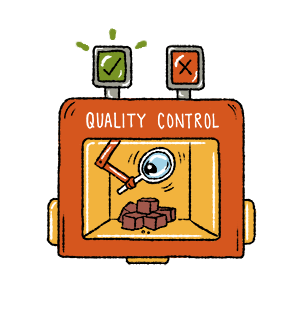
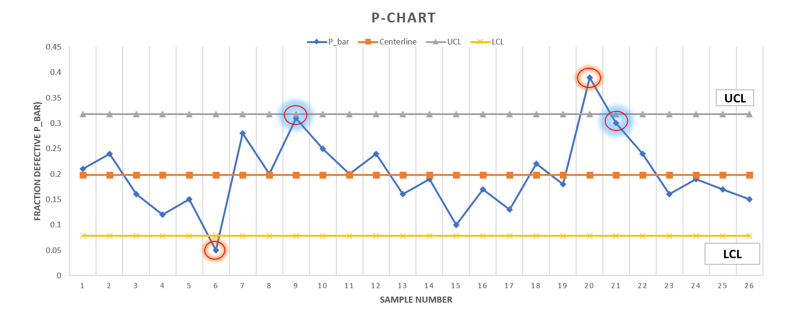
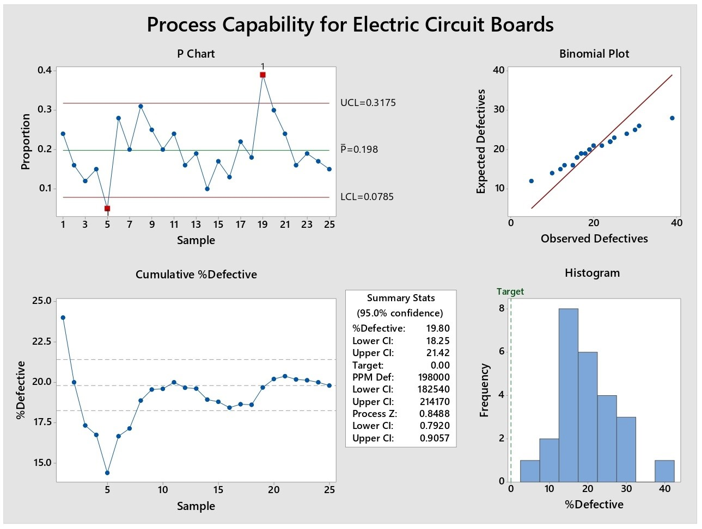
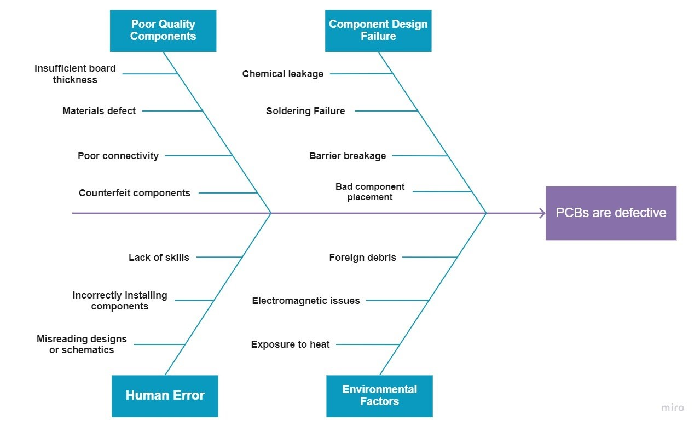

# Defect-Analysis-of-Electric-Circuit-Boards-using-Statistical-Process-Control-SPC-for-Quality-Mgmt.
- This project is about considering a hypothetical company which manufactures Electric Circuit Boards (ECB). 
- During the quality control the boards are checked for their quality and only two outcomes are expected: either the circuit boards are defective
(have some defects/don’t work properly/do not pass the quality tests) or they pass the quality checks and are packaged to be shipped or placed in ready to use inventory. 
- ECBs are important for any electrical equipment. 
- Their quality statistics can make or break equipment and which in turn causes disruption in manufacturing, supply chain, logistics.  
- The defective units are recorded, their output rate is monitored, and based on these analysis is done to check the quality of the ECBs. 
- This analysis is done through the Statistical Process Control using the various quality tools and techniques for the enhancement of the quality control in the manufacturing.

#

# Control Chart Selection Decision Tree

# P-Chart For Attribute Data

# nP-Chart 

# Process Capability Analysis: Minitab

# Root Cause Analysis: Fishbone Diagram

